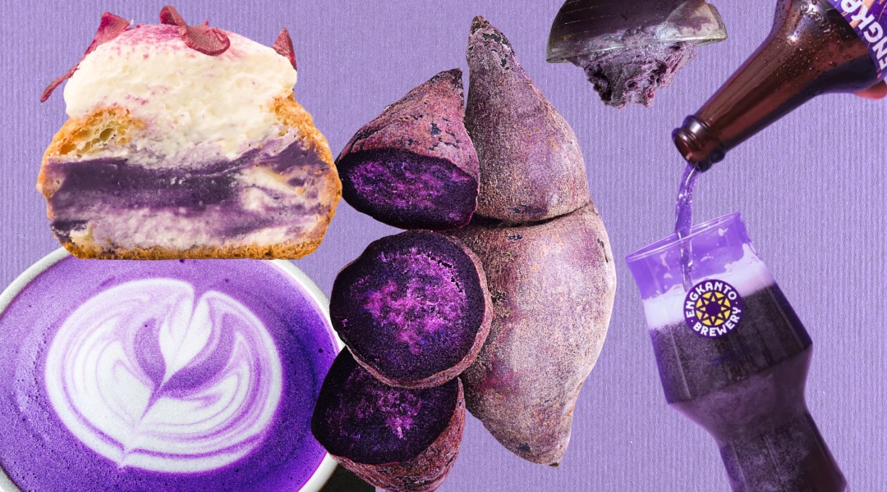
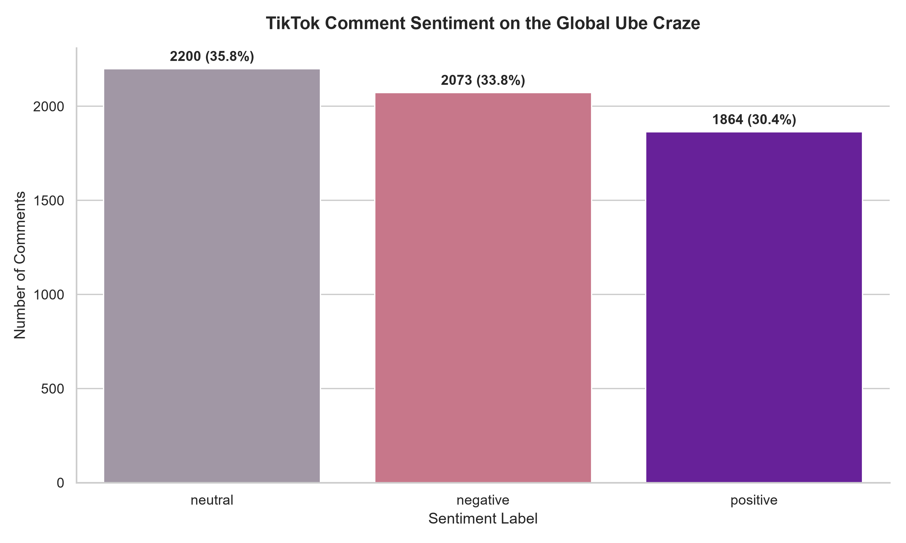
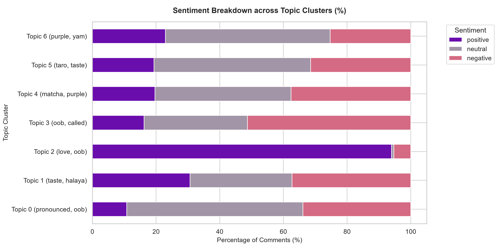
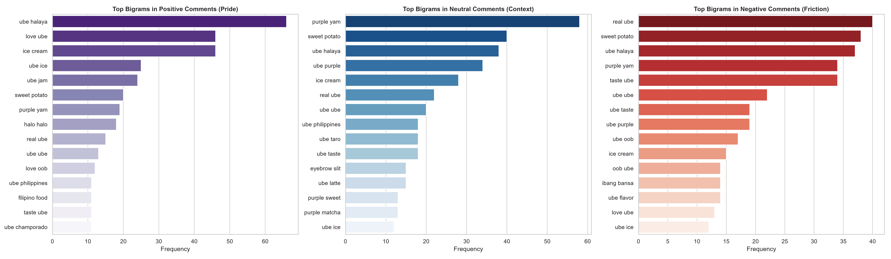
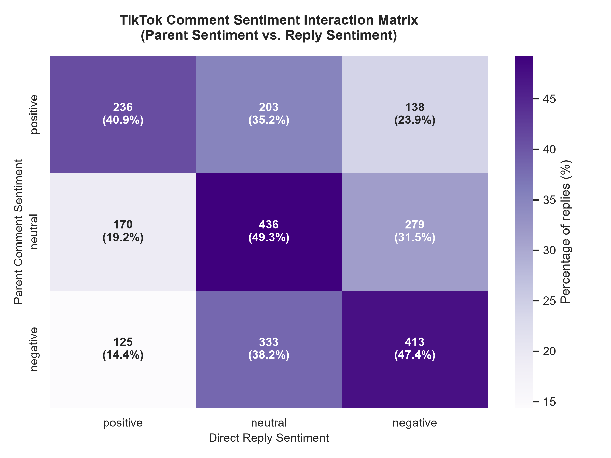

# ube-craze-tiktok-nlp <!-- omit from toc -->

<p align="center">
  
  <br>
  <em>Image Source: <a href="https://lifestyleasia-onemega.com/dining/the-world-is-crazy-about-ube/">Lifestyle Asia (One Mega)</a></em>
</p>


     

An analysis of Filipino digital gastronationalism on TikTok, specifically focusing on the global commercialization and trend of **Ube** (_Dioscorea alata_), using natural language processing (NLP) techniques. Created for the course **GEWORLD (The Contemporary World)**.

## Table of Contents <!-- omit from toc -->

- [1. Introduction \& Background](#1-introduction--background)
- [2. Project Structure](#2-project-structure)
- [3. Getting Started](#3-getting-started)
  - [3.1. Technical Prerequisites](#31-technical-prerequisites)
  - [3.2. Installation](#32-installation)
  - [3.3. Target Videos (`links.txt`)](#33-target-videos-linkstxt)
- [4. Running the Pipeline](#4-running-the-pipeline)
  - [4.1. Step 1: Bulk Scraping](#41-step-1-bulk-scraping)
  - [4.2. Step 2: Preprocessing \& Language Filtering](#42-step-2-preprocessing--language-filtering)
  - [4.3. Step 3: Sentiment Analysis](#43-step-3-sentiment-analysis)
  - [4.4. Step 4: NLP Analysis \& Visualization](#44-step-4-nlp-analysis--visualization)
- [5. Key Visualizations \& Results](#5-key-visualizations--results)
  - [5.1. Sentiment Distribution](#51-sentiment-distribution)
  - [5.2. Topic Clustering (K=7, TF-IDF + LSA)](#52-topic-clustering-k7-tf-idf--lsa)
  - [5.3. Phrase Frequencies (N-Grams)](#53-phrase-frequencies-n-grams)
  - [5.4. Reply Sentiment Dynamics](#54-reply-sentiment-dynamics)
- [6. NLP Methodology \& Model](#6-nlp-methodology--model)
- [7. License](#7-license)

## 1. Introduction & Background

This project explores the phenomenon of **digital gastronationalism** (DeSoucey, 2010; Jin, 2025) through the lens of the global popularity of **ube** (purple yam). As a staple of Filipino culinary heritage, ube has transitioned from a traditional ingredient associated with family gatherings and regional identity to a highly commodified global food trend popularized on visual social media platforms like TikTok.

This transformation has sparked ongoing online discourse regarding **cultural ownership, authenticity, and representation**. When foreign content creators or corporate entities exoticize or market ube solely for its vibrant purple hue without acknowledging its cultural roots, it can trigger concerns of cultural dilution or erasure. Conversely, digital gastronationalism empowers the Filipino diaspora and local users to reclaim their narrative, assert cultural authority, and exercise soft power online.

To investigate these dynamics, this project implements an end-to-end NLP data pipeline:

1. **TikTok Scraper**: A network-intercepting Playwright scraper that fetches metadata, comments, and nested reply threads.
2. **Language Filter**: Filtering out foreign-language commentary to focus strictly on English, Tagalog, and Taglish commentary using the `lingua-language-detector` library.
3. **Multilingual Sentiment Model**: Local batch inference using CardiffNLP's XLM-RoBERTa transformer (`twitter-xlm-roberta-base-sentiment`) to classify sentiment.
4. **Text Mining & Clustering**: Sentiment interaction matrices, bigram/trigram extraction, and unsupervised K-Means clustering to discover emerging themes in comment discussions.

For the full theoretical framing, methodology, and citations, please refer to the approved [GEWORLD Project Proposal](docs/proposal.md).

## 2. Project Structure

A high-level overview of the repository organization:

```text
.
├── data/                       # Ignored directory hosting the data pipeline
│   ├── raw/                    # Raw scrapes: author_videoID folders with comments_raw.json, metadata.json, and video.mp4
│   ├── processed/              # Filtered, cleaned, and language-normalized comments CSVs
│   └── final/                  # Final consolidated sentiment datasets ready for plotting
├── docs/                       # Technical documentation & project specifications
│   └── proposal.md             # Approved GEWORLD project proposal
├── notebooks/                  # Interactive Jupyter Notebooks for reproducing the pipeline
│   ├── 01_scraping.ipynb       # Interactive web scraper testing and walkthrough
│   ├── 02_preprocessing.ipynb  # Language filtering, emoji removal, and token cleaning
│   ├── 03_sentiment_analysis.ipynb # XLM-RoBERTa transformer inference
│   └── 04_visualization.ipynb  # N-grams, K-Means clustering, heatmaps, and plotting
├── outputs/                    # Exported figures, plots, and qualitative analysis documents
│   ├── clusters/               # Topic cluster statistics, size/sentiment distributions, and word clouds
│   ├── docs/                   # Qualitative analysis documents (insights and comment samples)
│   └── plots/                  # General sentiment distributions and bigram/trigram frequencies
├── src/                        # Core Python package codebase
│   └── ube_craze_nlp/
│       ├── nlp/                # Text cleaning (clean.py) and sentiment inference (sentiment.py)
│       ├── scraper/            # Playwright stealth driver (engine.py) and response parser (parser.py)
│       └── utils/              # Centralized path configurations (paths.py)
├── tests/                      # Unit test suites for the scraper and cleaning algorithms
├── pyproject.toml              # Unified dependency configuration managed by uv
├── links.txt                   # Root configuration file containing target video URLs
└── LICENSE                     # Project license file
```

## 3. Getting Started

### 3.1. Technical Prerequisites

Ensure you have the following installed on your local machine:

1. **Git**: Used to clone this repository.
2. **Python `>=3.11`**: (Managed by `uv` automatically if not present).
3. **uv**: Our unified Python package and project manager. Installation instructions: <https://docs.astral.sh/uv/getting-started/installation/>.

### 3.2. Installation

1. Clone this repository:
   ```bash
   git clone https://github.com/qu1r0ra/ube-craze-tiktok-nlp
   ```
2. Navigate to the project root and synchronize dependencies (this automatically sets up a local virtual environment `.venv`):
   ```bash
   cd ube-craze-tiktok-nlp
   uv sync
   ```

### 3.3. Target Videos (`links.txt`)

The scraper uses a root file named `links.txt` containing the target TikTok video URLs to scrape.

- Empty lines and lines starting with `#` are ignored.
- Currently, `links.txt` contains exactly 67 curated, high-engagement TikTok URLs categorized under key search terms (e.g., `#ube`, `#ube craze`, `#trader joes ube`, `#foreigner tries ube`, `#purple yam`, and `#ube pronunciation`).

## 4. Running the Pipeline

You can reproduce the full results by running the automated package commands or by executing the interactive Jupyter Notebooks.

### 4.1. Step 1: Bulk Scraping

To execute the scraper in headless mode across all 67 target URLs in `links.txt`:

```bash
uv run python -m ube_craze_nlp.scraper.engine
```

This script will:

- Boot up a stealth Playwright Chromium instance.
- Navigate to each URL, click the comments tab, scroll to retrieve up to 100 top-level comments, and click "View replies" to expand sub-comment threads.
- Save the raw intercepted JSON comments, video metadata, and the original `.mp4` video file under `data/raw/{author}_{video_id}/`.

### 4.2. Step 2: Preprocessing & Language Filtering

Run through the preprocessing stage by opening `notebooks/02_preprocessing.ipynb`. It reads raw JSON comments, sanitizes URLs and usernames, strips foreign text while keeping Tagalog, English, and Taglish via `lingua-language-detector`, and exports normalized tokens to `data/processed/cleaned_comments.csv`.

### 4.3. Step 3: Sentiment Analysis

Open `notebooks/03_sentiment_analysis.ipynb` to run CardiffNLP's local XLM-RoBERTa model on the cleaned data. It classifies each comment's sentiment into **positive, neutral, or negative** and exports the annotated dataset to `data/final/sentiment_comments.csv`.

### 4.4. Step 4: NLP Analysis & Visualization

Open `notebooks/04_visualization.ipynb` to run:

- **N-Gram Frequency Distributions**: Extracting the top bigrams and trigrams to identify the most common phrases.
- **K-Means Clustering**: Clustering comments using TF-IDF representation and analyzing cluster keywords.
- **Sentiment Heatmap**: Creating transition matrices plotting parent comments vs. reply sentiments to analyze how replies align with or contest parent threads.
- **Result Visuals**: Automatically exporting plots and documents to the reorganized `outputs/` subdirectories.

Alternatively, you can run the entire pipeline from Step 2 onwards in one go using the pipeline script:

```bash
# On Windows (avoids emoji console crashes)
$env:PYTHONIOENCODING="utf-8"; uv run python scripts/run_pipeline.py

# On macOS/Linux
uv run python scripts/run_pipeline.py
```

## 5. Key Visualizations & Results

Below are key visualizations and takeaways extracted from the final dataset of **6,137 unique English, Tagalog, and Taglish comments** harvested across the 67 video targets:

### 5.1. Sentiment Distribution

Using `twitter-xlm-roberta-base-sentiment`, the overall sentiment breakdown reveals a highly contested online discourse rather than passive aesthetic enjoyment:

<p align="center">
  
</p>

- **Neutral (35.8%)**: Educational remarks, ingredient questions, botanical comparisons, and simple culinary descriptions.
- **Negative (33.8%)**: Backlash against mispronunciations (e.g. "oob"), frustration over cultural gentrification (the "matcha-fication" of ube), and socioeconomic critiques regarding the neglect of local Filipino farmers.
- **Positive (30.4%)**: Cultural pride, food enjoyment, culinary advocacy, and welcoming foreigners attempting to try or cook traditional desserts.

### 5.2. Topic Clustering (K=7, TF-IDF + LSA)

Unsupervised K-Means clustering identifies seven distinct thematic arenas:

| Cluster       | Core Theme                             | Gastronationalist Implication                                                                                                                     |
| :------------ | :------------------------------------- | :------------------------------------------------------------------------------------------------------------------------------------------------ |
| **Cluster 0** | **Pronunciation Correction**           | Language as a gatekeeper of cultural respect. Commenters actively correct foreigners to preserve authentic naming (`oohbeh` vs. `oob`).           |
| **Cluster 1** | **Mainstream Catch-All & Economy**     | Focuses on socioeconomic realities, criticizing domestic agricultural neglect, farmer exploitation, and local shortages amidst global popularity. |
| **Cluster 2** | **Appreciation & Labor**               | Global culinary enjoyment paired with notes on how labor-intensive traditional ube halaya prep actually is.                                       |
| **Cluster 3** | **"Oob" Backlash & Memes**             | Highly emotional defensive reactions and memes targeting viral mispronunciations.                                                                 |
| **Cluster 4** | **"Matcha-fication" & Gentrification** | Anxieties that ube will be gentrified by corporate entities (e.g., Starbucks) without cultural recognition or returns.                            |
| **Cluster 5** | **Culinary Boundaries (Ube vs. Taro)** | Actively resisting cheap commercial substitutions of ube with taro powder and purple dye.                                                         |
| **Cluster 6** | **Botanical & Technical Accuracy**     | Educational correction clarifying that ube is a purple yam (`Dioscorea alata`), not a sweet potato or taro.                                       |

Here is the distribution of sentiment across these clusters:

<p align="center">
  
</p>

### 5.3. Phrase Frequencies (N-Grams)

Examining multi-word phrases (bigrams/trigrams) highlights the primary linguistic markers:

<p align="center">
  
</p>

- **Cultural Authenticity**: Phrases like `ube halaya`, `purple yam`, and `filipino dessert` assert cultural roots.
- **Commercialization & Substitution**: Phrases like `taro taste` and `matcha latte` signal discussions around flavor boundaries and product gentrification.

### 5.4. Reply Sentiment Dynamics

A sentiment transition matrix tracks the relationship between parent comments and their nested replies, illustrating how conflict is negotiated:

<p align="center">
  
</p>

- **Negative Parent Trigger**: Negative parents generate the highest rate of negative replies (45.3%), showing that criticism or cultural friction sparks intense digital defensiveness or correction.
- **Positive Parent Synergy**: Positive parent comments are met with positive replies (45.9%), reflecting supportive spaces where digital gastronationalism acts as a source of community bonding and soft power.

For more detailed qualitative analysis and specific comment samples from each cluster, see [outputs/docs/cluster_insights.md](outputs/docs/cluster_insights.md).

## 6. NLP Methodology & Model

- **Sentiment Model**: CardiffNLP's [twitter-xlm-roberta-base-sentiment](https://huggingface.co/cardiffnlp/twitter-xlm-roberta-base-sentiment) is a multilingual XLM-RoBERTa transformer fine-tuned on ~198M multilingual tweets. It handles mixed-language text (such as code-switching Taglish common in Filipino online spaces) much more robustly than English-only Lexicon models (e.g., VADER).
- **Language Support**: Filters inputs using `lingua-language-detector` set to retain `ENGLISH` and `TAGALOG` text, ensuring unrelated foreign commentary (e.g., Indonesian, Spanish, Portuguese) does not pollute the dataset.

## 7. License

This project is licensed under the **Apache License 2.0**. See the [LICENSE](LICENSE) file for the full text.
